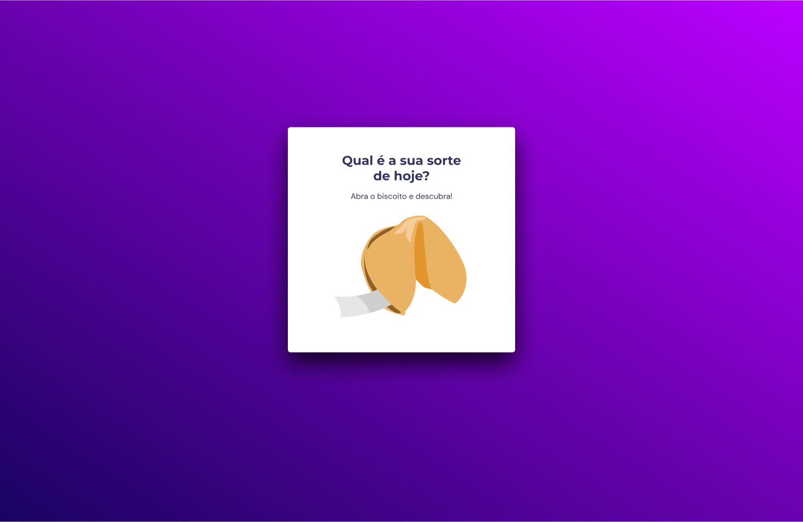
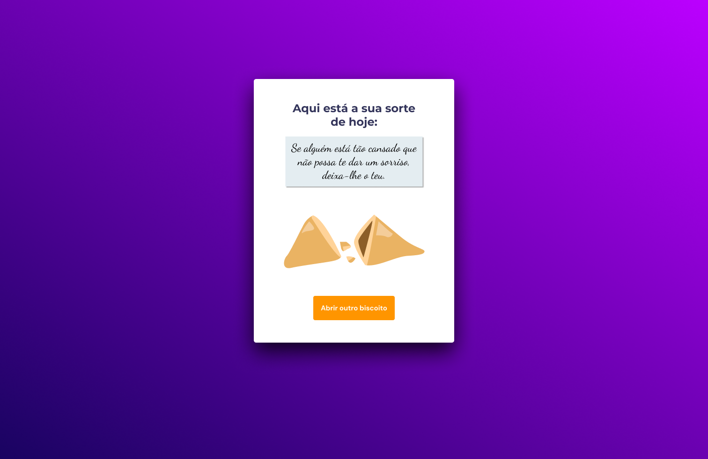
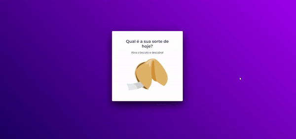

  

   
   

  

    <a href="#-desafio">Desafio</a>&nbsp;&nbsp;&nbsp;|&nbsp;&nbsp;&nbsp;
    <a href="#-tecnologias">Tecnologias</a>&nbsp;&nbsp;&nbsp;|&nbsp;&nbsp;&nbsp;
    <a href="#-layout">Layout</a>&nbsp;&nbsp;&nbsp;|&nbsp;&nbsp;&nbsp;
    <a href="#-contato">Contato</a>
  

  
  

## Sobre o desafio

Este projeto consiste em uma interface web simples, construída como parte da trilha Explorer oferecida pela Rocketseat.
Neste desafio deverá criar um jogo chamado Biscoito da Sorte, no qual o usuário, a partir de um clique ou enter, abre um biscoito com a sua sorte do dia. Aplicando o que aprendeu sobre vários temas, entre eles:

* Estrutura de dados HTML
* Animações com CSS
* Funções no Javascript
* Manipulação da DOM
* Funções callback
* Arrays

## Tecnologias
- HTML
- CSS
- JavaScript
- Figma

## Layout da aplicação
<table>
  <tr>
    <td></td>
    <td></td>
  </tr>   
</table>

## Demonstração
Aqui está uma prévia do resultado final do projeto desenvolvido
[Link Demonstração](https://joao-sillva.github.io/biscoito-da-sorte/)

## Contato
Se você tiver alguma dúvida ou quiser entrar em contato, você pode me enviar uma mensagem pelo
[LinkedIn](https://www.linkedin.com/in/joao-sillva/).

(<a href="#readme-top">voltar ao topo</a>)
